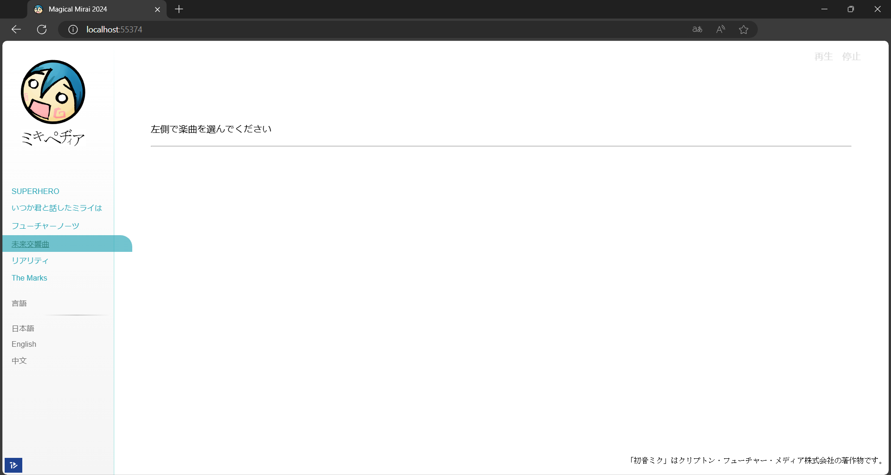
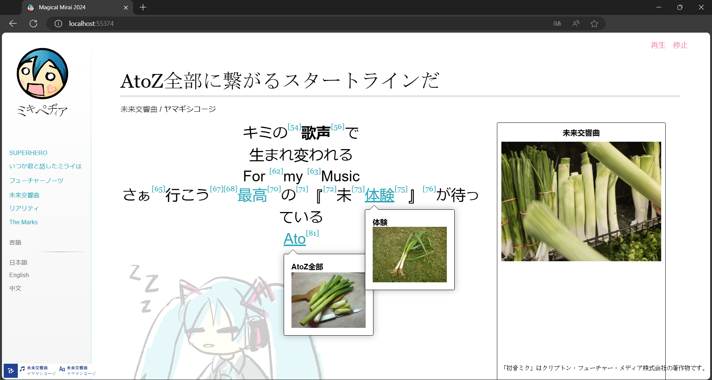
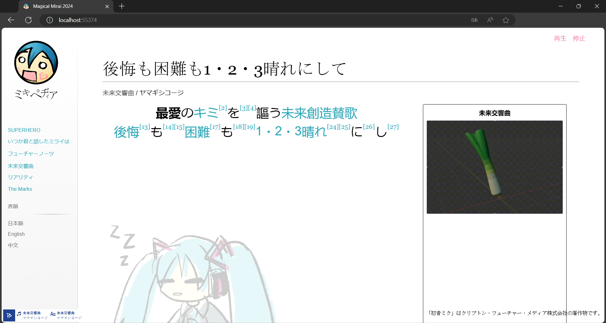
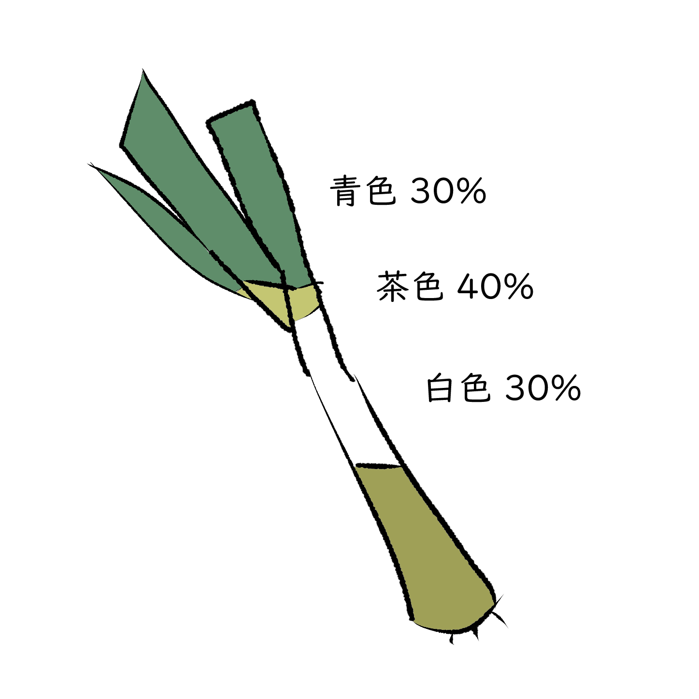

# 初音ミク「マジカルミライ 2024」プログラミング・コンテスト：MIKIPEDIA

## 使い方　Usage
```
git clone git@github.com:kevinjycui/Miku-Procon-2024.git
cd Miku-Procon-2024
npm i
npm run build-dev
```

そして、リンクを開く（例えば、http://localhost:1234 ）

Then, open the link (e.g. http://localhost:1234)
```
$ npm run build-dev

> magicalmirai2024@1.0.0 build-dev C:\Users\miku\Miku-Procon-2024
> parcel src/index.html --dist-dir dev

Server running at http://localhost:1234
Building...
Bundling...
√ Built in 428ms
```

そして、左側で楽曲を選む

Afterwards, select a song from the left



## イメージ Images
使ったイメージの全部は自分が作ったイメージとか、ウィキペディアで探したCC0ライセンスのイメージだ。

All images are made by myself or CC0 licensed images found on Wikipedia.









